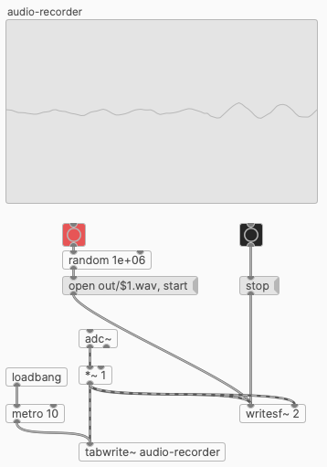

# Audio recorder

[Pure Data](https://puredata.info/downloads) audio recorder derived from Q Visible's [Pure Data Tutorial 16 - adc~ object sound from microphone](https://www.youtube.com/watch?v=po2_Cml2ooo). 

## Usage

Click the red button, or `open out/$1.wav, start`, to begin recording.

Click the black button, or `stop`, to stop recording.

Recording are saved in the folder `out` as WAV, with a random filename between 1-1000000 (so as not to overwrite previous recordings).
